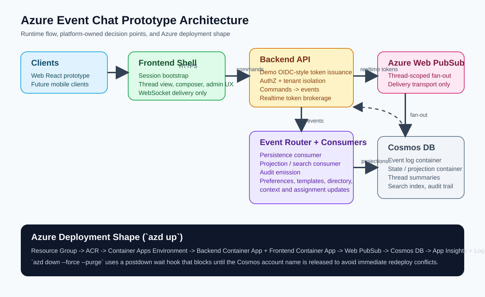
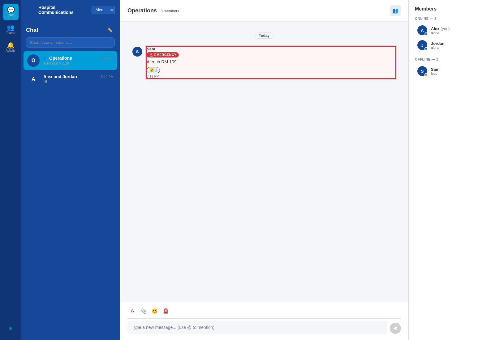
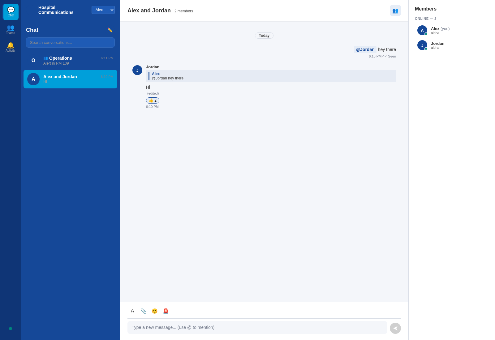

# Azure Event Chat Prototype

Azure-native, event-driven chat prototype for a secure multi-tenant SaaS messaging platform using React, Node.js, Azure Web PubSub, and Cosmos DB.



## Overview

- Event-driven backend where commands become typed domain events before persistence and delivery.
- Azure Web PubSub used only for realtime fan-out; business logic remains in platform-owned services.
- `azd` deployment shape now provisions ACR, a Container Apps environment, backend/frontend container apps, Web PubSub, Cosmos DB, App Insights, and Log Analytics.

## Prerequisites

Open this repo in GitHub Codespaces or VS Code Dev Containers. The dev container is the supported environment.

## Quick Start

1. Reopen the repo in the dev container and let dependency installation finish.
2. Copy [apps/backend/.env.example](/workspaces/custom-azure-chat-service/apps/backend/.env.example) to `apps/backend/.env` if you want to override defaults.
3. Run `npm run dev` for the local prototype, or `npm run typecheck && npm run test` for a validation-only pass.
4. Run `bash scripts/validate.sh --local` for the Pass 1 local validation harness.

## Azure Deploy

```bash
az login --use-device-code
azd auth login --use-device-code
azd up
```

`azd up` provisions the Azure resources from Bicep, then runs `scripts/azd-postprovision.sh` to build and push the backend/frontend images to ACR and update the Container Apps. The repo is configured with Azure-side remote builds, so local Docker or Podman is not required in the dev container.

Cleanup:

```bash
azd down --force --purge
```

The repo includes `scripts/azd-postdown.sh`, which waits for the Cosmos DB account name to be fully released before returning so immediate redeploys do not trip over global Cosmos name conflicts.

## Parameters

| Variable | Default | Notes |
|---|---|---|
| `PORT` | `8080` | Backend API port |
| `CORS_ORIGIN` | `http://localhost:5173` | Frontend origin for local dev |
| `DEMO_TENANT_ID` | `tenant-demo` | Default tenant claim for the demo auth flow |
| `DEMO_AUTH_SECRET` | `dev-only-demo-secret-change-me` | HMAC secret for signed demo bearer tokens |
| `DEMO_AUTH_TOKEN_TTL_MINUTES` | `60` | Demo token lifetime |
| `WEB_PUBSUB_CONNECTION_STRING` | empty | Enables Azure Web PubSub publishing when supplied |
| `WEB_PUBSUB_HUB` | `chat` | Azure Web PubSub hub |
| `COSMOS_ENDPOINT` | empty | Cosmos DB account endpoint |
| `COSMOS_KEY` | empty | Cosmos DB account key |
| `COSMOS_DATABASE` | `chatPrototype` | Cosmos DB database name |
| `COSMOS_EVENTS_CONTAINER` | `events` | Authoritative event log container |
| `COSMOS_STATE_CONTAINER` | `state` | Projection/read-model container |
| `VITE_API_BASE_URL` | `http://localhost:8080/api` | Frontend API base URL |

## What Gets Deployed

1. Azure Container Registry for backend and frontend images.
2. Container Apps environment plus separate backend and frontend container apps.
3. Azure Web PubSub for room-scoped realtime delivery.
4. Azure Cosmos DB for the event log and state/projection containers.
5. Application Insights and Log Analytics for baseline observability.

## Screenshots

### Operations Chat



### Alex And Jordan Chat



## Current Status

- Pass 1 is complete: architecture skeleton, tenant-aware contracts, demo auth/token brokerage, Azure deployment skeleton, docs, and validation harness.
- Pass 2 is complete: list/open thread, send message, realtime delivery, typing indicators, automatic read receipts, reactions, pin/unpin, and a separate search projection path.
- Pass 3 is complete: room creation and deletion, participant add/remove/leave, message edit/delete/delivery/priority, archive/hide/mark-unread/follow-up state, thread-scoped notification preferences, quick template administration, directory filtering, context linking, assignment-driven membership updates, and audit visibility.
- Local development includes a WebSocket-based realtime fallback so the full working slice can be exercised without provisioning Azure Web PubSub.
- Validation includes backend unit and integration tests, workspace typecheck, shell smoke coverage, a multi-user Pass 2 UX test, and a Pass 3 admin/lifecycle UX test.

Architecture details live in [HOW_IT_WORKS.md](/workspaces/custom-azure-chat-service/HOW_IT_WORKS.md) and [docs/architecture.md](/workspaces/custom-azure-chat-service/docs/architecture.md).
