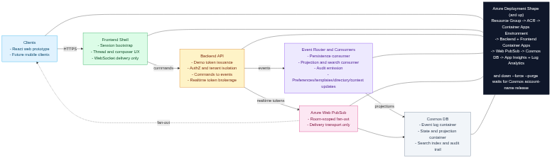
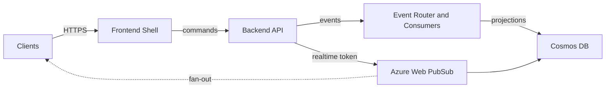

# Architecture

Editable source: [architecture.excalidraw](architecture.excalidraw)

Authoring standard: Excalidraw with Microsoft/Azure icons from RKrokson/msft-icons-excalidraw.

Legacy static export: [architecture.svg](architecture.svg)

Text-equivalent diagram (Mermaid accessibility fallback)

## Component Map

- `apps/frontend`: React prototype client with a left-rail thread list, active thread pane, search, reactions, read receipts, typing indicators, presence, and a demo session bootstrap flow.
- `apps/backend`: Express API with platform-owned auth, token brokerage, command handling, event creation, consumers, and realtime negotiation.
- `auth/demoIdentity.ts`: mock external-IdP handoff implemented as signed demo bearer tokens for local and prototype use.
- `EventRouter`: fan-out inside the backend to independent consumers.
- `PersistenceConsumer`: writes event log entries and updates lightweight read models.
- `ProjectionConsumer`: reserved seam for search, summary, unread, preference, and notification projections.
- `WebPubSubPublisher`: publishes room-scoped events to Azure Web PubSub for client delivery.
- `LocalRealtimePublisher`: dev/test fallback that preserves the same event-driven contract while using a local WebSocket server.
- `Cosmos DB`: durable event storage plus room/message/projection state.
- `Thread preference / notification / template / directory / audit state`: platform-owned data that sits alongside chat transport rather than inside it.

## Deployment Shape

- `azd` provisions the shared Azure resources and captures outputs into the environment.
- Azure Container Registry stores the backend and frontend images.
- A shared Container Apps environment hosts two apps: `backend` and `frontend`.
- Azure Web PubSub handles realtime fan-out for deployed clients.
- Cosmos DB stores the event log and state/projection documents.
- Application Insights and Log Analytics provide baseline diagnostics.

## Teardown Decision

The repository explicitly waits for Cosmos DB account-name release after `azd down --force --purge`. That decision is about operator ergonomics: the fastest local iteration loop is “deploy, test, destroy, redeploy”, and Cosmos global-name reservation is a common source of friction in that loop.

## Event Flow

1. Client sends HTTP command to the API.
2. Platform auth resolves tenant and user identity, then command handling validates input, checks idempotency, and assigns room sequence numbers when required.
3. Event envelope is created and passed to independent consumers.
4. Persistence consumer appends the event and updates projections.
5. Delivery adapter publishes the event to the room group in Azure Web PubSub.
6. Connected clients receive the event over WebSockets and reconcile optimistic UI state.

## Trust Boundaries

- The client only presents authenticated state and requests short-lived realtime access through the backend.
- Authorization and tenant isolation live in platform-owned backend services, not in WebSocket handlers and not in the frontend.
- Azure Web PubSub is a delivery fabric only; it is not the source of truth for membership, preferences, auditability, or search.
- Search and projections are separate from transport and can evolve independently in later passes.
- The local realtime fallback exists only so the working slice can be tested without Azure; the event publication contract is identical to the Azure path.
- Pass 3 keeps “commodity chat plus platform context” behavior server-side: templates, notification policies, linked context, assignment updates, and audit records all remain outside the WebSocket layer.

## Reliability Choices

- WebSockets are delivery only, not the system of record.
- Messages use room-scoped sequence numbers for ordering.
- Commands carry idempotency keys so retries do not double-create state.
- Typing is ephemeral with expiry.
- Read receipts and reactions are modeled as separate events to tolerate retries and reconnects.

## Prototype Simplifications

- The current Cosmos integration persists the event log first; richer projection persistence is still a later-pass task.
- Demo auth uses a signed local token instead of a full external OIDC deployment, but preserves the external-IdP to platform-token to realtime-token handoff shape.
- The UI now exercises the first working slice of the event vocabulary: thread open/list, messaging, typing, reactions, read receipts, pinning, and room search.
- The UI now also exercises the Pass 3 admin slice: thread admin, membership changes, message lifecycle controls, templates, directory search, context linking, assignment updates, and audit inspection.
- Live Azure validation is scaffolded now and will deepen as more deployed capabilities land.
