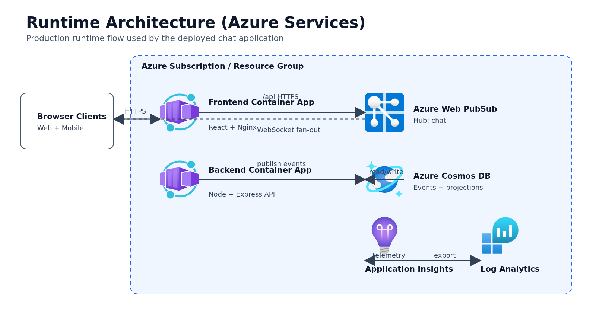
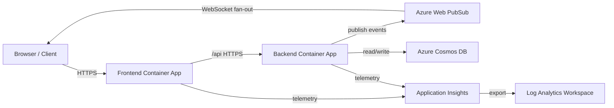

# Runtime Architecture

Editable source: [runtime-architecture.excalidraw](runtime-architecture.excalidraw)

Icon source: RKrokson/msft-icons-excalidraw (official Microsoft Azure architecture icon set packaging).

Text-equivalent diagram (Mermaid accessibility fallback)

